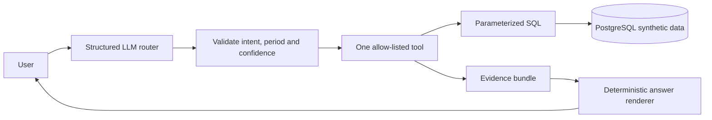

# Yuki Assistant V1 — Local Demo

A deliberately small, local-only demo of the Yuki AI Engineer case.

The demo exists to prove one narrow product/architecture thesis:

> The LLM handles language. Yuki owns every fact.

The assistant supports only three entrepreneur jobs:

1. **Status** — “Has last month been processed?”
2. **Attention / VAT** — “What am I still missing for VAT?”
3. **Financial** — “How much did I spend on suppliers this quarter?”

Everything else is explicitly out of scope.

> [!IMPORTANT]
> This repository is a **synthetic, read-only demo**. It does not connect to Yuki production systems, does not contain real accounting data and is not a production authentication or accounting product.

## Table of contents

- [What this project demonstrates](#what-this-project-demonstrates)
- [Prerequisites](#prerequisites)
- [Scope at a glance](#scope-at-a-glance)
- [Quick start](#quick-start)
- [Configuration](#configuration)
- [Architecture](#architecture)
- [Synthetic data and trust boundary](#synthetic-data-and-trust-boundary)
- [Core principles](#core-principles)
- [Documents](#documents)
- [Repository shape](#expected-repository-shape-after-implementation)
- [Database smoke check](#m01-database-smoke-check)
- [Assistant API](#assistant-api)
- [Tests and local routing evaluation](#tests-and-local-routing-evaluation)
- [Troubleshooting](#troubleshooting)
- [Suggested interview walkthrough](#suggested-interview-walkthrough)

## What this project demonstrates

The project is intentionally small enough to explain on a whiteboard and run on a laptop. Its key design decision is the trust boundary:

> Natural language is delegated to a local model; authorization, SQL, calculations, evidence and final claims stay in deterministic application code.

For a supported question, the server performs one bounded route → validate → tool → evidence → render flow. A malformed route, unavailable model, missing data or low-confidence result exits safely instead of falling back to keyword matching or invented facts.

## Prerequisites

| Requirement | Why it is needed |
| --- | --- |
| Docker Desktop with Compose v2 | Runs the ASP.NET app, PostgreSQL and the idempotent bootstrap |
| Ollama or MLX-LM | Provides the local OpenAI-compatible routing endpoint |
| .NET 10 SDK | Runs the normal test suite and supports local development |
| Bash and `curl` | Runs `start.sh` / `stop.sh` |
| Python 3 | Runs the optional router evaluation; MLX-LM also uses Python |
| A modern browser | Opens the static chat UI |

Node/npm is **not** required. The first run may need internet access to download Docker images and the selected local model, but the application itself does not depend on a cloud LLM or a real Yuki account.

## Scope at a glance

The assistant supports exactly three read-only entrepreneur jobs. Everything else is handled as unsupported, ambiguous or unsafe and does not execute a business tool.

| Intent | Example question | Deterministic source |
| --- | --- | --- |
| Processing status | Has last month been processed? | `accounting_periods` |
| VAT attention | What am I still missing for VAT? | `vat_periods` + unresolved `vat_attention_items` |
| Supplier spend | How much did I spend on suppliers this quarter? | processed `purchase_invoices` |

The seed is synthetic and relative to the current date. Its canonical supplier-spend result is **EUR 12,460.00 excluding VAT across 8 processed purchase invoices**. This number is computed by deterministic SQL-backed application code; it is not generated by the LLM.

## Quick start

Install Docker Desktop and one local OpenAI-compatible model runtime. Ollama is the
default path on Windows/Linux; macOS can use Ollama or MLX-LM on Apple Silicon:

```text
ollama pull qwen3.5:4b
```

On Apple Silicon, MLX-LM is also supported. Install `mlx-lm`, then configure the
provider in `.env`:

```text
LLM_PROVIDER=mlx
LLM_BASE_URL=http://host.docker.internal:8080/v1
LLM_MODEL=mlx-community/Qwen3-4B-Instruct-2507-4bit
```

MLX-LM is a host runtime and is not run in Docker. It is intended for macOS on
Apple Silicon; use Ollama on Windows and Linux.

Start the complete demo from the repository root with `.\start.ps1` in PowerShell
or `bash ./start.sh` in Bash. The script validates Docker and the configured LLM,
starts PostgreSQL, applies the idempotent schema/seed, builds the ASP.NET app and
waits for `/health`. It does not delete the database volume.

When the start command reports that the demo is ready, open <http://localhost:8088> in a browser. The static chat UI exposes the three supported questions as examples and displays each grounded answer together with its source IDs and freshness timestamp.

To let the script pull/start the configured local runtime when it is unavailable,
copy `.env.example` to `.env` and set `LLM_AUTOSTART=true`. Otherwise the script
prints the exact missing prerequisite command. With `LLM_AUTOSTART=false`, start
the runtime yourself before running the demo.

Stop with `.\stop.ps1` or `bash ./stop.sh`. These commands preserve the PostgreSQL volume and stop only an LLM process recorded as launched by this project.

For a deliberate full database reset, run `docker compose down -v` explicitly and
then start again. The normal stop command never removes the named database volume.

## Configuration

Copy `.env.example` to `.env` when you need to change the defaults. The local `.env` is ignored by Git; only the safe template belongs in the repository.

| Variable | Default | Purpose |
| --- | --- | --- |
| `APP_PORT` | `8088` | Host port for the ASP.NET Core app |
| `LLM_PROVIDER` | `ollama` | Selects `ollama` or `mlx` |
| `LLM_BASE_URL` | Ollama: `http://host.docker.internal:11434/v1` | Host model endpoint used by the app container |
| `LLM_MODEL` | Ollama: `qwen3.5:4b` | Local model used only for routing |
| `LLM_TIMEOUT_SECONDS` | `60` | Maximum router request time |
| `ROUTER_CONFIDENCE_THRESHOLD` | `0.70` | Minimum confidence required before a tool runs |
| `LLM_AUTOSTART` | `false` | Allows the script to start and own a missing local model process |
| `POSTGRES_DB` | `yuki_demo` | Local PostgreSQL database name |
| `POSTGRES_USER` | `yuki` | Local PostgreSQL user |
| `POSTGRES_PASSWORD` | `yuki_local_only` | Synthetic local-only database password |

For MLX-LM, set `LLM_PROVIDER=mlx`, `LLM_BASE_URL=http://host.docker.internal:8080/v1` and `LLM_MODEL=mlx-community/Qwen3-4B-Instruct-2507-4bit` together. MLX-LM is for macOS on Apple Silicon and is not run inside Docker.

`LLM_API_KEY=local-not-used` is only a compatibility placeholder for the OpenAI-compatible HTTP shape. Ollama and MLX-LM are local runtimes and do not require a real API key.

## Core principles

- Read-only.
- One demo market: NL.
- One synthetic entrepreneur / administration scope.
- Ground answers in SQL-backed deterministic facts.
- The LLM routes and extracts intent; it does not calculate financial values.
- No autonomous agents.
- No RAG or vector database.
- No MCP.
- No arbitrary SQL generated by an LLM.
- No tax or accounting advice.
- No long-term memory.
- No second LLM answer-composer in the core V1.
- Prefer a safe refusal/clarification over a fabricated answer.

## Architecture

```text
Browser
  |
  v
ASP.NET Core 10 app
  |- static chat UI
  |- assistant API
  |- LLM router adapter
  |- deterministic orchestrator
  |- 3 allow-listed tools
  |- evidence builder
  `- deterministic answer renderer
  |
  +----> PostgreSQL 18 (Docker)
  |
  `----> Local OpenAI-compatible model endpoint on host
         |- Ollama
         `- MLX-LM
```

The application and database run in Docker. The model runtime runs on the host so Ollama/MLX can use the native GPU/Apple Silicon runtime.

### Request flow



## Synthetic data and trust boundary

This repository does not contain Yuki production data. The database is deliberately seeded with a single fictional NL administration owned by the server:

| Field | Demo value |
| --- | --- |
| Tenant | `demo-tenant` |
| Administration | `northstar-bikes-nl` |
| Market | `NL` |
| Currency | `EUR` |

The browser sends only a message. Neither the user nor the model can provide an administration ID, SQL statement or arbitrary tool name. The SQL seed is relative to the current date and idempotent, so the demo remains reproducible without pretending to model Yuki's private schema.

The expected supplier-spend result is **EUR 12,460.00 excluding VAT across 8 processed invoices**. The draft invoice and previous-quarter invoice are excluded by the deterministic business rule. Evidence contains source IDs and freshness so every successful answer can be inspected.

## Documents

Read these before implementation:

1. [`AGENTS.md`](./AGENTS.md) — mandatory Codex instructions and non-negotiable invariants.
2. [`ROADMAP.md`](./ROADMAP.md) — small milestones; implement one milestone at a time.
3. [`docs/PRODUCT_SCOPE.md`](./docs/PRODUCT_SCOPE.md) — exact V1 scope and product behavior.
4. [`docs/ARCHITECTURE.md`](./docs/ARCHITECTURE.md) — request flow and component boundaries.
5. [`docs/DOMAIN_DATA.md`](./docs/DOMAIN_DATA.md) — synthetic SQL model and canonical business rules.
6. [`docs/LLM_CONTRACT.md`](./docs/LLM_CONTRACT.md) — router schema, prompts and local providers.
7. [`docs/TRUST_TESTING.md`](./docs/TRUST_TESTING.md) — grounding, safe exits, tests and evals.
8. [`docs/RUNTIME_DEV.md`](./docs/RUNTIME_DEV.md) — Docker, environment and lifecycle scripts.
9. [`docs/DECISIONS.md`](./docs/DECISIONS.md) — explicit architecture decisions and rejected complexity.

## Expected repository shape after implementation

```text
/
├─ AGENTS.md
├─ ROADMAP.md
├─ README.md
├─ compose.yaml
├─ .env.example
├─ start.ps1
├─ start.sh
├─ stop.ps1
├─ stop.sh
├─ src/
│  └─ YukiAssistantDemo/
│     ├─ YukiAssistantDemo.csproj
│     ├─ Program.cs
│     ├─ Assistant/
│     ├─ Data/
│     └─ wwwroot/
├─ tests/
│  └─ YukiAssistantDemo.Tests/
├─ db/
│  ├─ 001_schema.sql
│  └─ 002_seed.sql
└─ docs/
   └─ ...
```

Do not create extra services, frameworks or abstractions unless a documented requirement cannot be satisfied without them.

## M01 database smoke check

Start and bootstrap the synthetic PostgreSQL source of truth:

```text
docker compose up -d db
docker compose run --rm db-init
```

Verify the canonical facts:

```text
docker compose exec -T db psql -U yuki -d yuki_demo -c "SELECT status FROM accounting_periods WHERE id = 'accounting-period-previous-month';"
docker compose exec -T db psql -U yuki -d yuki_demo -c "SELECT COUNT(*) AS unresolved_items FROM vat_attention_items WHERE vat_period_id = 'vat-period-current' AND NOT resolved;"
docker compose exec -T db psql -U yuki -d yuki_demo -c "SELECT COUNT(*) AS invoice_count, SUM(net_amount) AS net_amount FROM purchase_invoices WHERE id LIKE 'purchase-invoice-q-current-%' AND status = 'PROCESSED';"
```

The expected results are `PROCESSED`, `4`, and `8 / 12460.00`. Running `db-init` again is safe and idempotent.

To repeat the bootstrap check explicitly:

```text
docker compose run --rm db-init
```

For a clean local database reset, run `docker compose down -v` explicitly before starting again. This removes the named PostgreSQL volume and is not part of the normal stop flow.

## Assistant API

The read-only chat endpoint accepts only a message; scope is owned by the server:

```text
POST /api/chat
Content-Type: application/json

{ "message": "How much did I spend on suppliers this quarter?" }
```

Successful responses contain `outcome`, `answer`, `intent` and an `evidence` object with facts, source record IDs and freshness. Unsupported, ambiguous and unavailable-model/data cases return explicit safe responses and never fabricate accounting facts.

## Tests and local routing evaluation

The normal suite does not require Docker, PostgreSQL or a local model:

```text
dotnet test YukiAssistantDemo.slnx
```

The solution intentionally keeps the PostgreSQL project opt-in so this command
remains fast and local-model independent.

For PostgreSQL integration tests, start and bootstrap the database with the test Compose override, then run the integration category:

```text
docker compose -f compose.yaml -f compose.test.yaml up -d db
docker compose -f compose.yaml -f compose.test.yaml run --rm db-init
$env:YUKI_TEST_CONNECTION='Host=localhost;Port=55432;Database=yuki_demo;Username=yuki;Password=yuki_local_only'
dotnet test tests/YukiAssistantDemo.IntegrationTests/YukiAssistantDemo.IntegrationTests.csproj
```

The optional real-model routing evaluation uses only Python's standard library and is never part of normal tests:

```text
python tools/router_eval.py
```

It reads `.env`/environment configuration, derives provider-specific defaults for
Ollama and MLX, prints one pass/fail row per contract example, and exits non-zero
when a route does not match. It does not call the application, execute SQL or run
in normal CI.

## Troubleshooting

- Docker unavailable: start Docker Desktop and rerun the selected start script.
- Local LLM unavailable: start Ollama with `ollama serve`, or MLX-LM with
  `python3 -m mlx_lm.server --model <model> --host 0.0.0.0 --port 8080`.
- Ollama model missing: run `ollama pull qwen3.5:4b`, or set `LLM_MODEL` to the
  model installed locally.
- Port `8088` occupied: set another `APP_PORT` in `.env` and use the printed URL.
- MLX on unsupported hardware: select `LLM_PROVIDER=ollama` instead; MLX is not
  containerized or expected on Linux.

## Suggested interview walkthrough

For a short, concrete demo:

1. Start the project with `start.ps1` or `start.sh` and show the single URL.
2. Ask the three canonical questions and point out the exact amount, source IDs and freshness metadata.
3. Ask one paraphrase and one unsupported question to show LLM routing and safe exits.
4. Explain the trust boundary: the model selects an intent; deterministic SQL-backed code owns the answer.
5. Show the normal tests, then mention the separate PostgreSQL integration tests and manual real-model evaluator.

That sequence demonstrates product judgment, grounding, operational reproducibility and safety without adding production complexity that the three-job V1 does not need.
