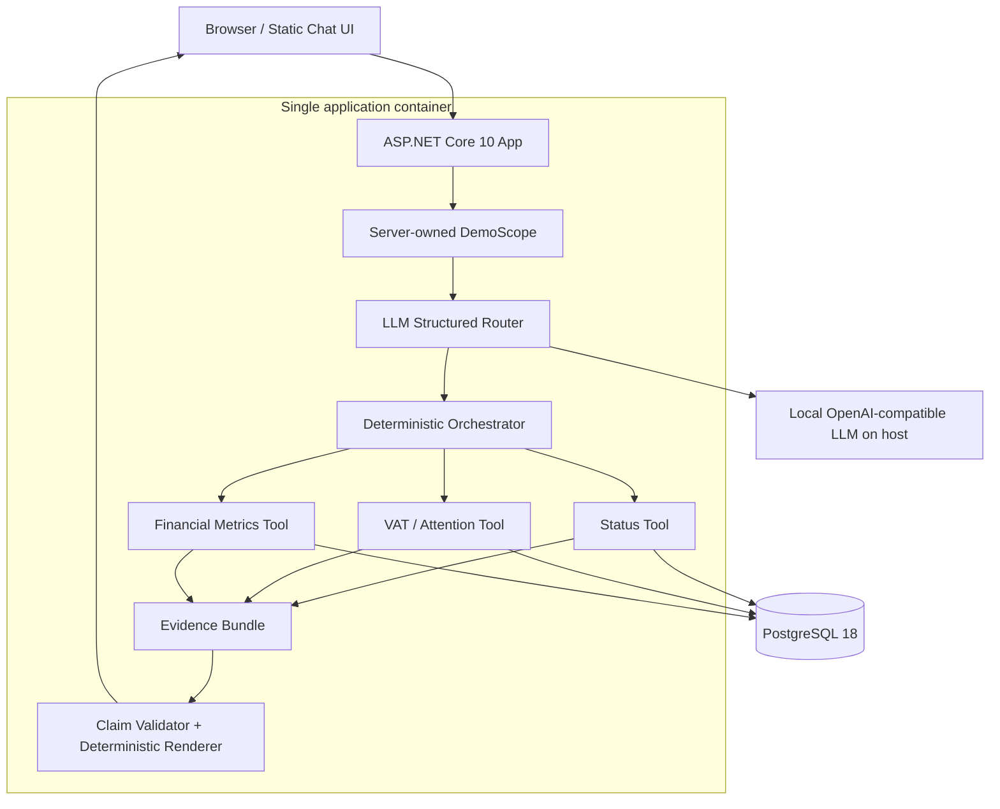

# Architecture — Yuki Assistant V1

## Design goal

Preserve the presentation's trust boundary while implementing the smallest possible local system.

Presentation principle:

> LLMs route and explain; Yuki authorizes, retrieves, computes and validates.

Demo simplification:

- Use one ASP.NET Core application for UI + API + orchestration + tools.
- Use the LLM only for routing.
- Omit the optional second LLM answer composer.
- Use PostgreSQL as the synthetic Yuki source of truth.
- Run Ollama/MLX on the host.
- Do not create a separate Python AI microservice.

This is intentionally smaller than a possible production architecture.

## System topology



## End-to-end request flow

### 1. Product/UI

The browser sends only:

```json
{
  "message": "How much did I spend on suppliers this quarter?"
}
```

It does not send:

- tenant ID;
- domain ID;
- administration ID;
- SQL/filter object;
- tool name.

### 2. Server-owned scope

The backend attaches a fixed synthetic scope from server configuration:

```text
tenant = demo-tenant
administration = northstar-bikes-nl
market = NL
currency = EUR
```

This simulates the real rule that authenticated product context owns authorization.

### 3. LLM structured router

The backend asks the local LLM to return a validated routing object.

Example:

```json
{
  "intent": "supplier_spend",
  "period": "current_quarter",
  "confidence": 0.98,
  "clarification": null
}
```

The LLM cannot name a database/table/query or scope ID.

### 4. Deterministic orchestrator

The orchestrator:

- validates the router result;
- enforces confidence threshold;
- maps only known intent enum -> known tool;
- resolves relative periods in application code;
- executes one deterministic tool.

No agent loop is used.

### 5. Deterministic tool

A tool:

- uses server-owned scope;
- runs parameterized SQL;
- applies documented canonical business rules;
- computes exact values in code/SQL;
- produces facts + source IDs + freshness.

It does not produce user-facing natural-language prose.

### 6. Evidence bundle

Example conceptual bundle:

```json
{
  "intent": "supplier_spend",
  "facts": {
    "periodStart": "2026-07-01",
    "periodEnd": "2026-09-30",
    "currency": "EUR",
    "netAmount": 12460.00,
    "invoiceCount": 8
  },
  "sources": [
    "purchase-invoice-001",
    "purchase-invoice-002"
  ],
  "freshness": "..."
}
```

### 7. Claim validation + renderer

For V1, validation is structural:

- expected facts are present;
- values have the expected types;
- money has currency;
- sources exist;
- the tool result belongs to the active scope.

A deterministic template inserts exact facts.

The LLM does not rewrite the number.

### 8. Grounded answer UI

The UI shows:

- answer;
- evidence/source summary;
- freshness;
- optional technical intent label only if useful for demo/debug.

Because the demo has no real Yuki accounting pages, source IDs are enough. Do not create fake deep-linked screens purely to mimic production navigation.

## Three allow-listed tools

Only these tool capabilities exist:

```text
period_processing_status
vat_missing_items
supplier_spend
```

There is no generic query tool.

There is no `execute_sql`.

There is no `get_any_financial_metric`.

This is intentional.

## Safe exits

### Low confidence

```text
Router confidence < threshold
  -> no tool execution
  -> concise clarification or supported-scope reminder
```

### Unsupported intent

```text
unsupported
  -> no tool execution
  -> explain the 3 supported jobs
```

### Invalid router output

```text
parse/validation failure
  -> at most one repair attempt
  -> safe error if still invalid
```

### Missing data

```text
tool finds no authoritative record
  -> renderer explains the information cannot be determined
```

### DB unavailable

```text
tool failure
  -> safe assistant error
  -> no fabricated fallback
```

### LLM unavailable

```text
router cannot run
  -> safe assistant error
  -> do not silently switch to exact-string matching
```

## Why no LLM #2 in core V1

The presentation deliberately labels the answer composer as optional.

For only three stable answers, deterministic templates are:

- faster;
- easier to validate;
- less likely to alter exact financial values;
- easier to demonstrate as grounded;
- simpler across Ollama and MLX.

A second model call can be evaluated later when answer variety or complex explanation becomes a real requirement.

## Why no Python microservice in the demo

The presentation's future implementation can reasonably use:

- C#/.NET for product integration;
- Python for AI services/evals.

For a three-intent localhost demo, splitting the router into another HTTP service would add:

- another container/process;
- another contract;
- more health/startup logic;
- more failure modes;
- no user value.

The demo therefore collapses those boundaries into one .NET app while preserving clean internal modules. A production split remains possible later.

## Why PostgreSQL for the demo

The slide says “Yuki services / SQL”, not that the demo must reproduce Yuki's actual datastore.

PostgreSQL is selected because it is:

- SQL;
- small and easy to seed;
- well supported by Docker;
- practical on Windows/Linux/macOS/Apple Silicon;
- sufficient to demonstrate deterministic retrieval.

Do not couple the domain contract to PostgreSQL-specific features unnecessarily.

## Why the model runtime stays outside Docker

Ollama and MLX are hardware runtimes, not application dependencies.

In particular, MLX targets Apple Silicon/macOS and should not be put inside a Linux Docker container.

The app container talks to the host endpoint through `host.docker.internal` (with Linux host-gateway configuration where needed).

## Observability for V1

Use ordinary structured application logs only.

Log:

- request correlation ID;
- router intent/confidence;
- selected tool;
- tool duration;
- LLM duration;
- total duration;
- safe-exit reason;
- source count.

Do not log full sensitive-style invoice data unnecessarily.

No OpenTelemetry stack, tracing backend, MLflow or monitoring platform is required for the demo.
